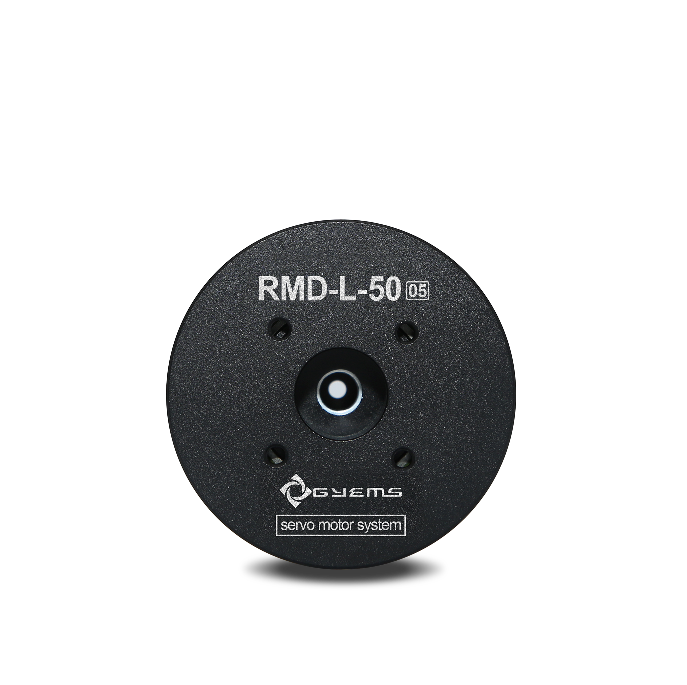
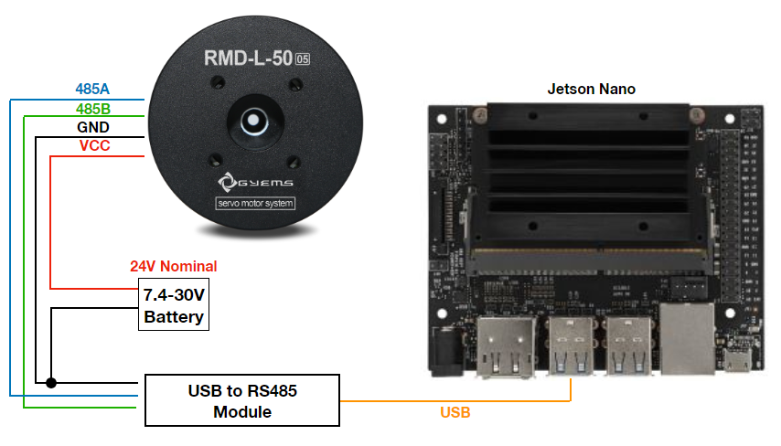
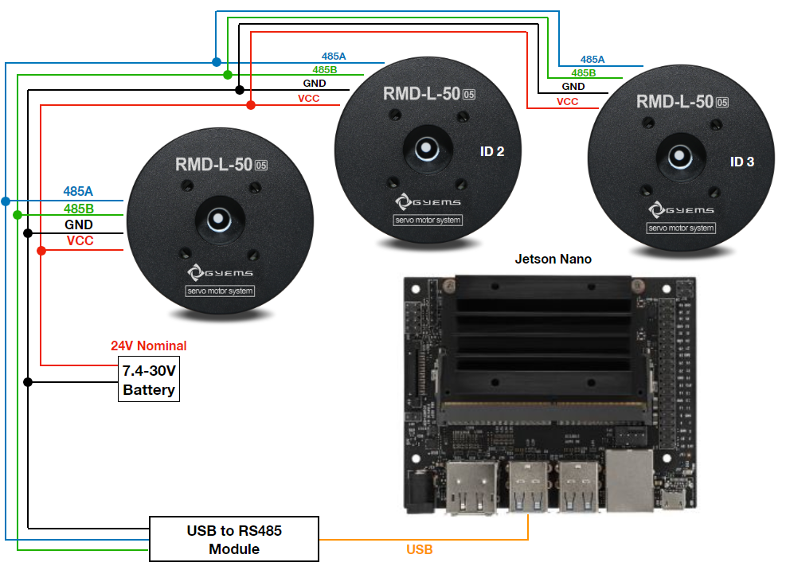

# GYEMS-Servo-Python

This is a python version from [this repo](https://github.com/rasheeddo/GYEMS-Servo). For more detail about config the servo, please follow the process in that repo.



# Hardware
1. GYEMS servo motor
2. Jetson Nano (or equivalent machine)
3. USB to RS485 module
4. Battery (7.0 to 30.0 V)

From above hardware, we just make some cable between USB-RS485 module to servo and plug to the Jetson Nano like this figure.



# Single Servo Example

Let take a look on some example in the repo, for example, examplePositionControl.py.
```
from GYEMSClass import *
import time

GY = GYEMS(1)  # create an object with servo ID

## Uncomment one of these modes for testing
## Reset power ON/OFF when changes mode

# [Multi-turns with maximum speed mode]
#GY.PositionControlMode1(480)			# input: targetAngle in degree  

# [Multi-turns with desired speed mode]		
#GY.PositionControlMode2(150,360)		# input: targetAngle, targetSpeed in degree and degree/seconds 	

# [Single-turn with max. speed and direction mode]										
#GY.PositionControlMode3(40,1)			# input: targetAngle (0~360), direction in degree and 0 for clockwise, 1 for couter-clockwise	

# [Single-turn with desired speed and direction mode]	
GY.PositionControlMode4(45,90,1)		# input: targetAngle (0~360), targetSpeed, direction in degree, degree/seconds and 0 for clockwise, 1 for couter-clockwise

while True:

	# read current angle from encoder
	# the angle would be 0~360 degree works well with Mode3 and Mode4, 
	# but in multi-turns mode the encoder cannot cummulate the turns, so the angle would show 0~360
	CurrentDeg = GY.GetCurrentDeg()
	print('CurrentDeg',CurrentDeg)
	print('--------------')
	time.sleep(0.01)
```
You can uncomment and test each control mode. 
  
# Multiple Servo Example
Due to the communication is RS485, so we can jump the A-B wires to next servo and set with different ID. The wiring can be found from here



```
GY = GYEMS(1)  # create an object with servo ID 1
GY2 = GYEMS(2)  # create an object with servo ID 2
```
In python script, just make an object of each servo ID like this.
  
